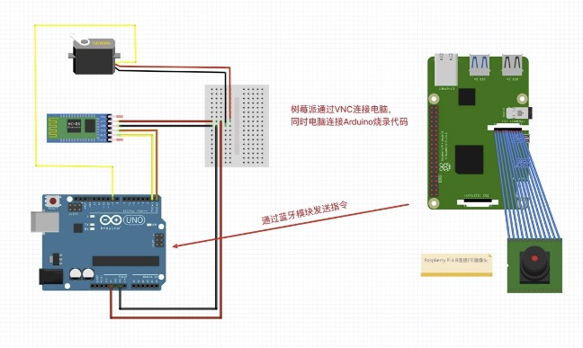
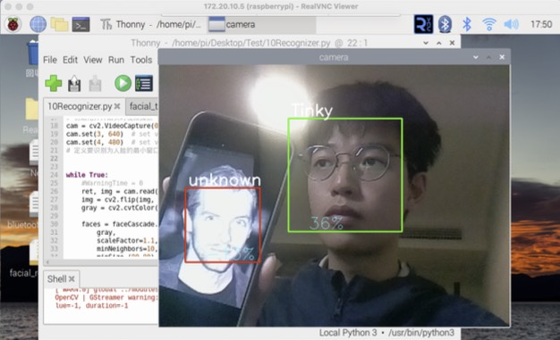
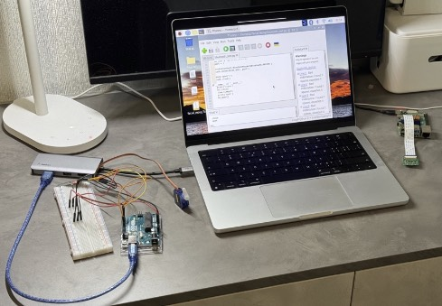

# 基于树莓派和OpenCV的人脸识别门禁系统

## 项目简介

本项目是一个基于树莓派(Raspberry Pi)和OpenCV的智能人脸识别门禁系统。系统通过摄像头捕获用户面部信息，利用OpenCV进行人脸识别，并结合Arduino控制的舵机实现门禁控制功能。当识别到已注册的用户面部时，系统会自动打开门锁，同时发送邮件通知；对于未注册用户，系统将拒绝开门。

## 系统功能

- **人脸信息采集**：采集用户面部数据并保存
- **模型训练**：基于采集的数据训练人脸识别模型
- **人脸识别**：实时检测并识别用户身份
- **门禁控制**：根据识别结果控制门锁开关
- **邮件通知**：当有人通过门禁时发送邮件通知
- **用户界面**：提供友好的图形用户界面进行操作

## 系统组成

### 硬件部分

- 树莓派主板
- USB摄像头
- Arduino控制板
- 舵机执行器
- 蓝牙模块（用于树莓派与Arduino通信）

### 软件部分

- OpenCV库（人脸检测与识别）
- Python图形界面（Tkinter）
- Arduino程序（控制舵机）
- 蓝牙通信程序

## 系统架构

系统由树莓派作为主控单元，通过USB摄像头采集图像，使用OpenCV算法进行人脸识别处理，识别结果通过蓝牙模块传输给Arduino控制板，由Arduino控制舵机执行开/关门操作。

## 使用方法

1. **信息采集**：在UI界面输入姓名，点击"信息采集"按钮
2. **模型训练**：点击"模型训练"按钮，系统将基于采集的数据训练模型
3. **人脸识别**：点击"识别"按钮进行测试性人脸识别
4. **门禁控制**：点击"门禁识别"按钮启用门禁功能

## 系统效果

---

# Face Recognition Door Access System Based on Raspberry Pi and OpenCV

## Project Introduction

This project is an intelligent face recognition door access system based on Raspberry Pi and OpenCV. The system captures user facial information through a camera, uses OpenCV for face recognition, and combines with an Arduino-controlled servo to implement door access control functions. When a registered user's face is recognized, the system automatically opens the door lock and sends an email notification; for unregistered users, the system will deny access.

## System Features

- **Facial Data Collection**: Collect and save user facial data
- **Model Training**: Train face recognition model based on collected data
- **Face Recognition**: Real-time detection and identification of users
- **Access Control**: Control door lock based on recognition results
- **Email Notification**: Send email notifications when someone accesses the door
- **User Interface**: Provide a friendly graphical user interface for operation

## System Components

### Hardware

- Raspberry Pi board
- USB camera
- Arduino controller
- Servo actuator
- Bluetooth module (for communication between Raspberry Pi and Arduino)

### Software

- OpenCV library (face detection and recognition)
- Python graphical interface (Tkinter)
- Arduino program (servo control)
- Bluetooth communication program

## System Architecture

The system uses Raspberry Pi as the main control unit, captures images through the USB camera, processes face recognition using OpenCV algorithms, transmits recognition results to the Arduino control board via Bluetooth module, and the Arduino controls the servo to perform door opening/closing operations.

## Usage Instructions

1. **Data Collection**: Enter name in the UI interface, click the "信息采集" (Data Collection) button
2. **Model Training**: Click the "模型训练" (Model Training) button, the system will train the model based on collected data
3. **Face Recognition**: Click the "识别" (Recognition) button to test face recognition
4. **Access Control**: Click the "门禁识别" (Door Access Recognition) button to enable the access control function

## System Results

 